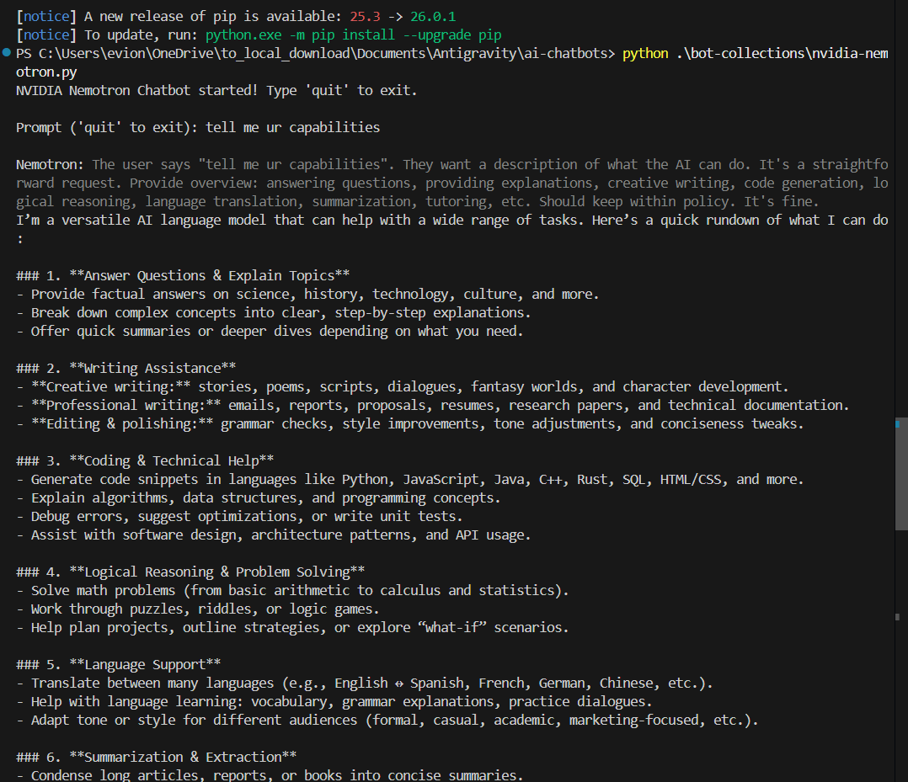
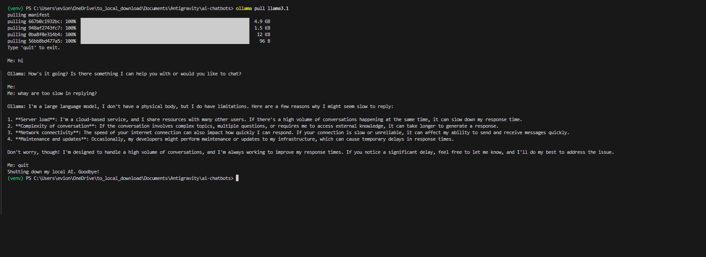

# My Elite AI Chatbots & Council

> [!IMPORTANT]
> **A Note on OpenAI Credits:** While this project supports OpenAI, please note that using GPT models requires paid API credits. If you encounter quota issues, I have integrated **NVIDIA Nemotron** as a robust, high-performance alternative that provides similar reasoning capabilities without the same credit constraints.

This is my personal collection of elite AI chatbots and a council of high-performance, locally-managed chatbot terminals that hook directly into the world's most powerful Large Language Models (LLMs).

By design, this project bypasses web-based UI limitations, allowing me to interact with models via **raw API streams** for maximum speed, privacy, and control.

---

## ⚡ Core Features & Stack

*   **Multi-Provider Integration:** I hit endpoints for Google Gemini, Groq, Cohere, HuggingFace, NVIDIA, OpenAI, and local Ollama.
*   **Asynchronous Architecture:** Every script I wrote utilizes Python's `asyncio` loop to handle non-blocking real-time text streaming.
*   **Multimodal Capabilities:** My Gemini implementation handles native image analysis using PIL (Pillow).
*   **Recursive Reasoning:** My NVIDIA Nemotron bot is configured to expose the model's internal "thinking" traces.

---

## 🛠️ Getting Started

I've made the setup process modular and straightforward:

### 1. Environment Setup
```bash
# I recommend using a virtual environment
python -m venv venv
.\venv\Scripts\activate  # On Windows
source venv/bin/activate # On Mac/Linux

# Install my curated list of dependencies
pip install -r requirements.txt
```

### 2. Configuration
Create a `.env` file in the root directory. This is where I store my sensitive API credentials. I've gathered links on how to obtain each key as required:

*   **OpenAI:** Sign up and create a key at [platform.openai.com](https://platform.openai.com/api-keys).
*   **Groq:** Obtain your LPU-powered key at [console.groq.com](https://console.groq.com/keys).
*   **Ollama:** No API key needed! Just download and install from [ollama.com](https://ollama.com/).
*   **Hugging Face:** Generate a User Access Token at [huggingface.co/settings/tokens](https://huggingface.co/settings/tokens).
*   **Google Gemini:** Get your API key for free at [aistudio.google.com](https://aistudio.google.com/app/apikey).
*   **Cohere:** Register and grab your key from [dashboard.cohere.com](https://dashboard.cohere.com/api-keys).
*   **NVIDIA NIM:** Sign up for free and get your API key at [build.nvidia.com](https://build.nvidia.com/).

```env
GEMINI_API_KEY="your_google_key"
HF_API_KEY="your_huggingface_token"
COHERE_API_KEY="your_cohere_key"
GROQ_API_KEY="your_groq_key"
OPENAI_API_KEY="your_openai_key"
# Optional extras
NVIDIA_API_KEY="your_nvidia_key"
```

### 3. Execution
Simply run any bot from my [`bot-collections/`](./bot-collections) directory:
```bash
python .\bot-collections\gemini.py
```

---

## 📸 Technical Showcase

I've documented my progress with live terminal captures:

#### [Cohere V2 Interface](./bot-collections/cohere_bot.py)
I use the Command-R model for its incredible markdown formatting and accuracy.


#### [Gemini Vision Interface](./bot-collections/gemini.py)
My Gemini bot can "see" local files. I pass raw images directly into the API stream.


#### [Groq Speed Inferences](./bot-collections/groq_bot.py)
Utilizing Groq's LPU hardware, I can generate tokens at near-instant speeds.


#### [NVIDIA Reasoning Traces](./bot-collections/nvidia-nemotron.py)
I've enabled "Thinking" mode here, showing the model's logic in grey text before the answer.



#### Local AI Panel (Private)
For total privacy, I run Llama 3.1 entirely on my own hardware using Ollama.



---

## 🧪 Ongoing Maintenance
Because HuggingFace rotations are unpredictable, I use [`test_hf.py`](./test_hf.py). This diagnostic script automatically pings different models to find which one is currently active on the free-tier Serverless API for me.

---
*Developed from a first-person perspective to explore the leading edge of AI API integration.*
