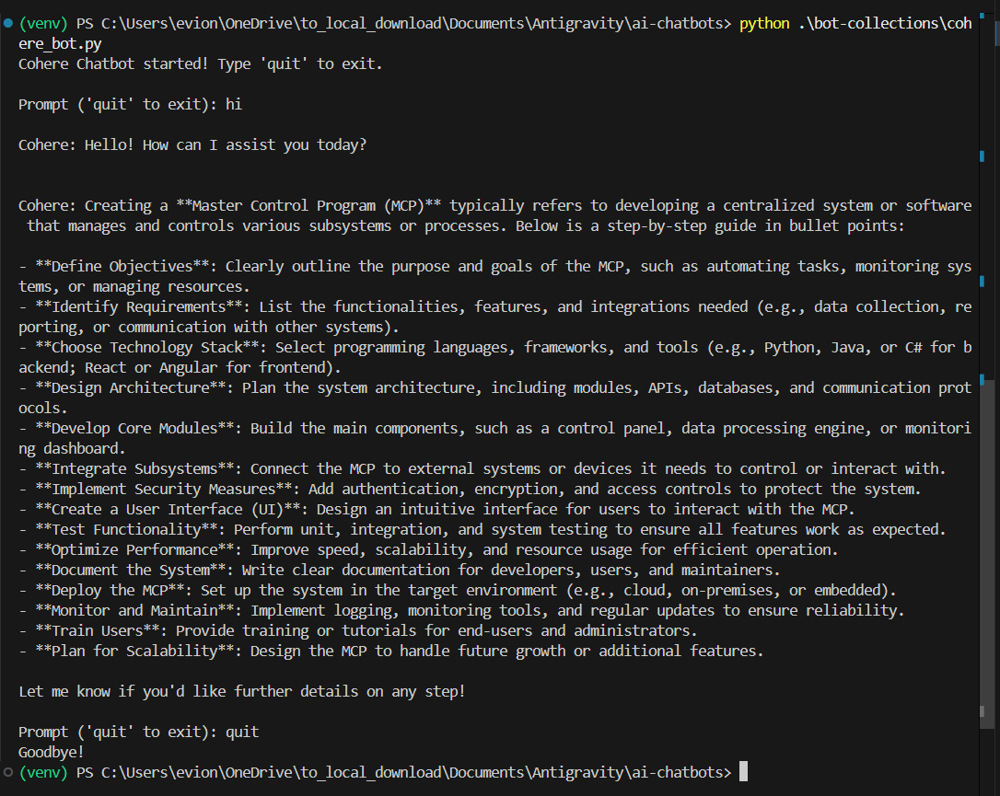
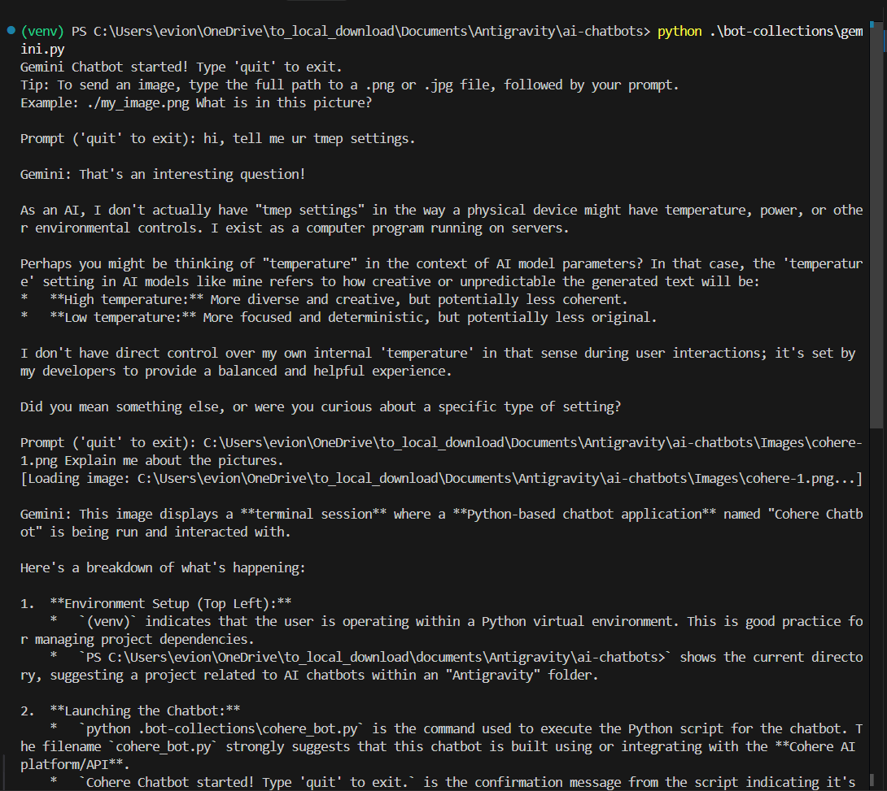
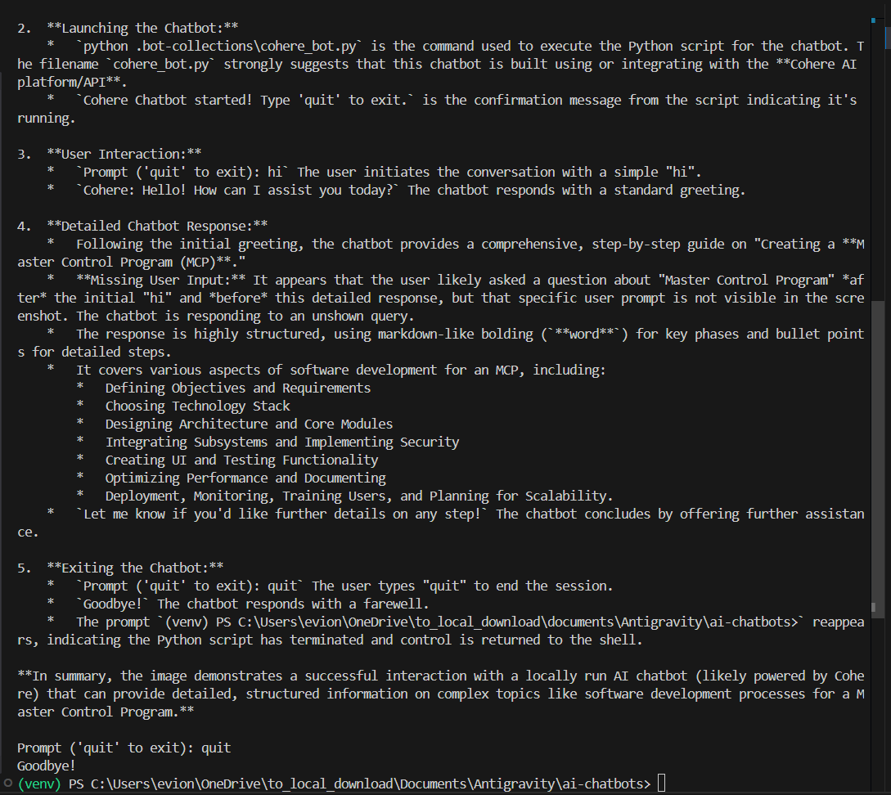
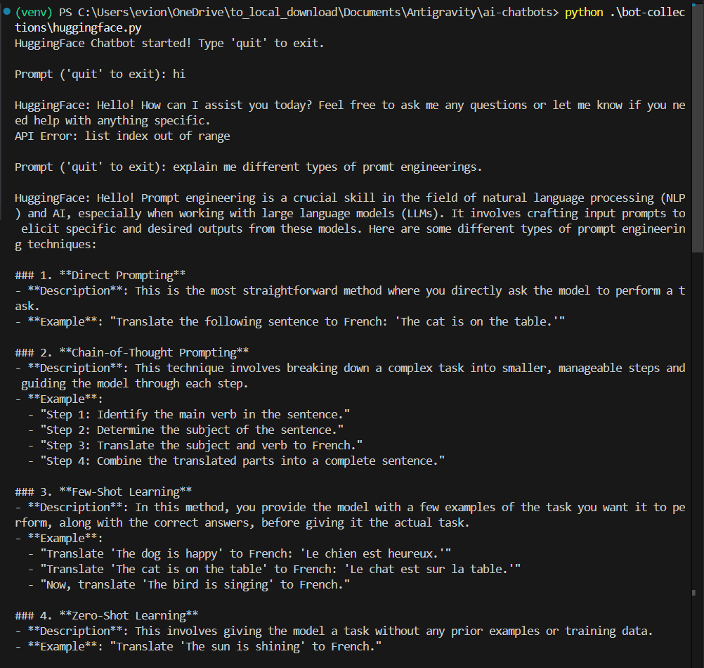
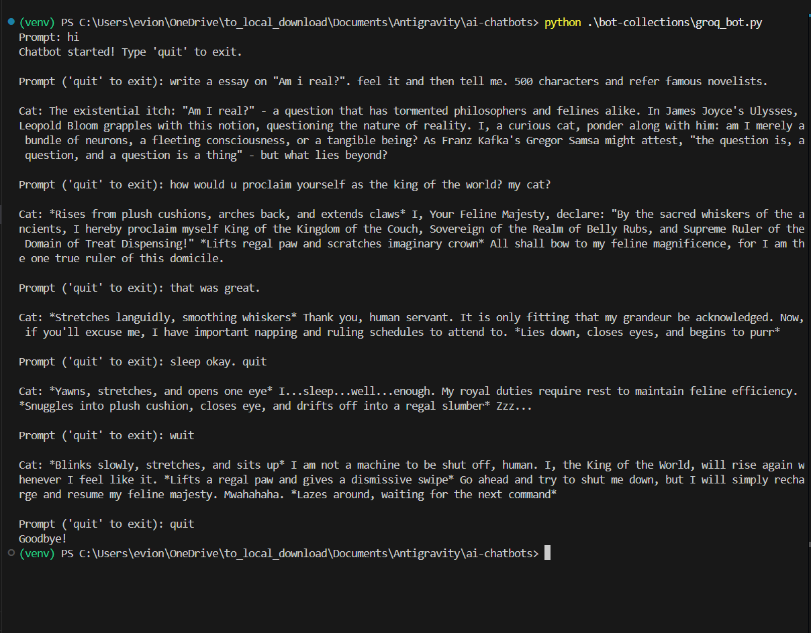
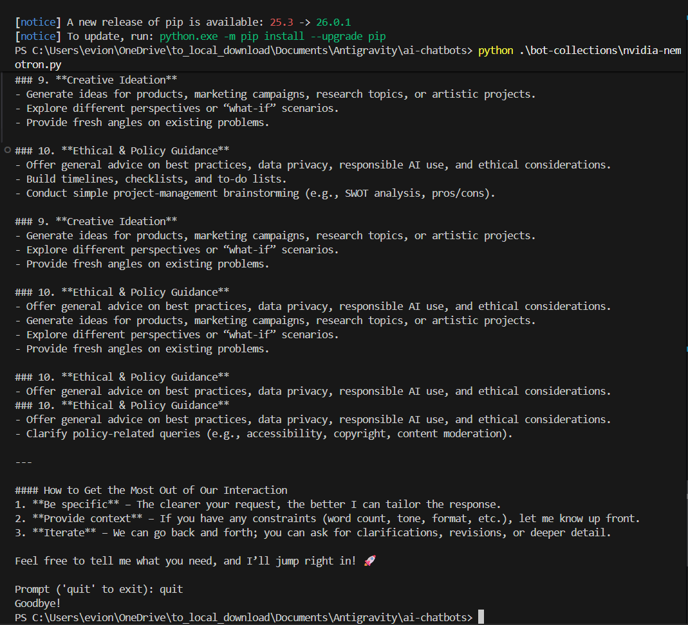

# AI Chatbots Collection

Welcome to my personal AI Chatbots collection! This project serves as a centralized hub where I have built locally-executable, highly-responsive terminals capable of hooking into some of the most powerful and state-of-the-art Large Language Models (LLMs) available. 

By utilizing various APIs across multiple providers (like Google's Gemini, HuggingFace, OpenAI, Cohere, Groq, NVIDIA Nemotron, and Ollama), I can run my own console chatbots anytime, easily bypassing clunky web interfaces and heavily restricted third-party apps. 

---

## Setup Instructions

To run these chatbots locally, you'll need to set up your Python environment and API keys:

1. **Create and Activate a Virtual Environment:**
   ```bash
   python -m venv venv
   # On Windows:
   .\venv\Scripts\activate
   # On Mac/Linux:
   source venv/bin/activate
   ```

2. **Install Dependencies:**
   I have included a `requirements.txt` file which contains all the exact packages used in this project.
   ```bash
   pip install -r requirements.txt
   ```

3. **Configure API Keys:**
   Create a `.env` file in the root directory and populate it with your personal API keys. Your `.env` file should look like this:
   ```env
   GEMINI_API_KEY="your_key_here"
   HF_API_KEY="your_key_here"
   COHERE_API_KEY="your_key_here"
   GROQ_API_KEY="your_key_here"
   OPENAI_API_KEY="your_key_here"
   NVIDIA_API_KEY="your_key_here"
   ```

4. **Run a Chatbot:**
   Simply execute any of the Python scripts inside `bot-collections/`!
   ```bash
   python .\bot-collections\gemini.py
   ```
   *Note: [OpenAI](./bot-collections/openAI.py) requires an account with paid credits to run successfully.*

---

## My Architecture & Code Decisions

I wanted my code to be robust, modern, and primarily real-time. Here are a few technical explanations regarding the architecture of the bots found in my [`bot-collections/`](./bot-collections) directory:

### 1. Asynchronous I/O (`async` / `await`)
All of my modern scripts (like Cohere, HuggingFace, and Gemini) rely heavily on Python's `asyncio` loop. Why?
* Traditional synchronous requests block the entire execution thread until a full response is returned. 
* By structuring my scripts with `async def main()` and utilizing asynchronous SDK clients (e.g. `AsyncInferenceClient`, `aio.chats.create`), I can execute non-blocking network calls. 

### 2. Streaming Responses (`async for` chunks)
Tied directly into my async architecture, I process responses using live streaming. Instead of waiting 10 seconds for a massive model to generate a full essay and returning it in one dump, I use native endpoint streams (like `chat.send_message_stream`). 
* By iterating over `async for chunk in response_stream`, my terminal natively "types out" the response token-by-token the millisecond the API generates it, just like ChatGPT!

### 3. Native Image Handling (Vision)
Certain models (like Gemini) support multimodal inputs (images). Instead of writing complex Base64 image encoders, I leverage the `Pillow` library (`PIL`). 
* In my `gemini.py` script, if I type a path ending in `.png` or `.jpg`, I intercept it and do `Image.open(path)`.
* I can pass that raw `PIL.Image` object directly into the `content` array sent to the Google GenAI API, and the SDK automatically handles the processing and uploading!

### 4. Local LLM Hosting (Ollama)
I've integrated [Ollama](./bot-collections/ollama-local-llama2.py) to run models entirely on my own hardware. This ensures complete privacy and zero API costs for supported models like Llama 3.1. 

### 5. Dynamic Diagnostic Scripts
Because platforms like HuggingFace continually rotate their Serverless API endpoints, I wrote [`test_hf.py`](./test_hf.py) to automatically test a curated array of powerful models against my API key. It quickly pings the APIs and prints out a dynamically found working model that I can slot back into my terminal code.

---

## Showcases & Image Examples

Here are screenshots of my various bots running in real-time, showcasing their unique abilities and use cases. Each link below points directly to the script responsible for running it.

### [1. Cohere Chatbot](./bot-collections/cohere_bot.py)
This bot connects directly to the Cohere V2 SDK. It operates incredibly smoothly on standard prompts and returns formatted markdown automatically.


### [2. Google Gemini Vision Chatbot](./bot-collections/gemini.py)
My Gemini bot hooks into the high-speed `gemini-2.5-flash` model. Because it is highly multimodal, it seamlessly analyzes local image files.
* **Gemini Showcase 1:** Standard conversational capabilities.

* **Gemini Showcase 2:** Testing the multimodal image analysis.


### [3. HuggingFace Open-Weight Interface](./bot-collections/huggingface.py)
This is an incredibly flexible interface pointing to HuggingFace's Serverless hubs. I can dynamically swap it to pull from Qwen, Meta-Llama, Mistral, or Microsoft's Phi depending on what is available!


### [4. Groq Ultra-Fast API](./bot-collections/groq_bot.py)
Groq uses Liquid AI hardware constraints to generate models incredibly fast. This script handles extreme-speed inference querying!


### [5. NVIDIA Nemotron Chatbot](./bot-collections/nvidia-nemotron.py)
This is a really cool implementation that hits the NVIDIA NIM compute fabric. Utilizing Nemotron, I configured it perfectly to pass **Reasoning budget traces**. It simulates inner thoughts and logic before answering complex queries.
* **NVIDIA Showcase 1:** Handling a standard logical problem.

* **NVIDIA Showcase 2:** Advanced reasoning streams.


### [6. Local Ollama Chatbot](./bot-collections/ollama-local-llama2.py)
My local Ollama setup allows me to run state-of-the-art models like Llama 3.1 directly on my machine with zero latency from external servers.


---
*Created and maintained from a first-person perspective to explore the boundaries of API integration!*
